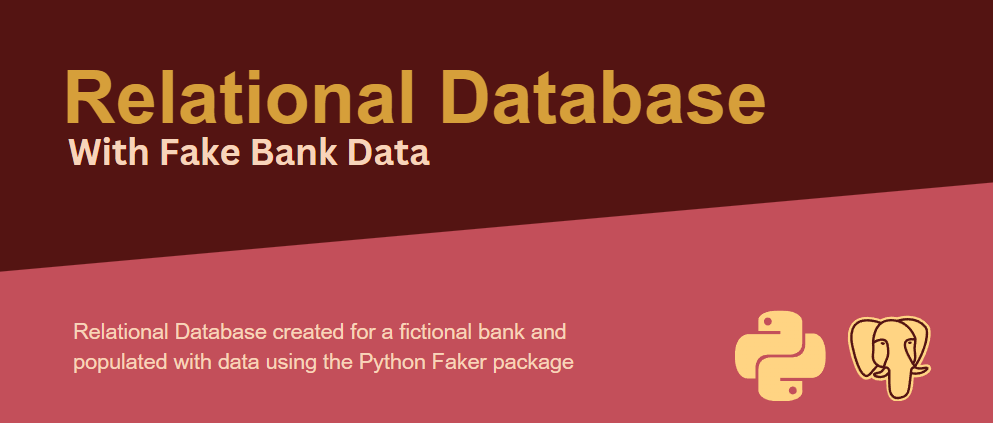
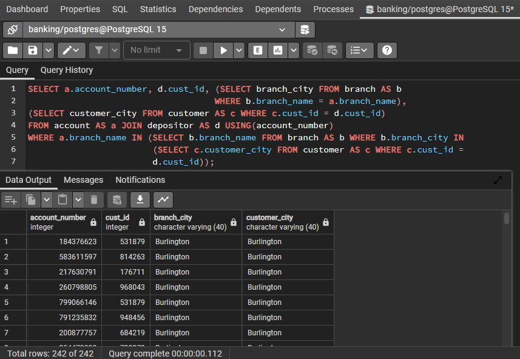

A relational database for a fictional bank based in my hometown of Burlington, Ontario , Canada. The data was generated using the Python, pandas, and the Faker package. Table creation, data importing, and queries are in postgreSQL.

## Dependencies

The fake data was generated using a python file here called 'fakerbankdata.py'. To run this file for yourself you will need the following installed:

- <a href="https://pypi.org/project/Faker/">Faker</a> (v18.9.0)
- <a href="https://pandas.pydata.org/">Pandas</a> (v1.5.3)
- <a href="https://www.python.org/">Python</a> (v3.9.13)

Table creation, data import, and queries were written in <a href="https://www.postgresql.org/download/">PostgreSQL</a> (v15), and tested using <a href="https://www.pgadmin.org/download/pgadmin-4-windows/">pgAdmin 4</a> (v.7.5)

## Generate your own data

To run the file to generate your own fake data for the database, open your terminal, navigate to the directory where the file is and input


```python
python fakerbankdata.py
```

## Test it yourself

The project SQL files contain code for table creation, importing the data, and potential queries to make on the data.

#### Example: What are the customer ID's and account numbers of customers who have an account in the same city that they live?

Using the related prepared query in the pgAdmin query tool, here's what the output might look like:



#### Thanks for taking the time to look at my project. If you have any questions you can reach me at:
- liamcamerononeill@gmail.com
- <a href="https://www.linkedin.com/in/liamconeill/">LinkedIn</a>


```python

```
